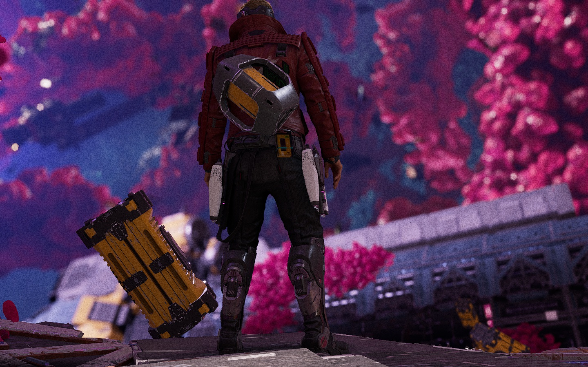

Certainly! Here's a `README.md` file written entirely in English:

---

# CombineFiles and SplitFiles

This project contains two command-line tools for binary file manipulation on Windows:


1. **CombineFiles**: Combines `.bin` files into a single file.
2. **SplitFiles**: Splits a file into multiple chunks of a specified size.

## Requirements

- Windows OS
- C++ Compiler (e.g., MinGW or Microsoft Visual Studio)

## Compilation

### CombineFiles

1. **Source**: `combine_files.cpp`
2. **Purpose**: Combines all `.bin` files in a directory into a single file.

To compile `combine_files.cpp`, use the following command:

```sh
g++ combine_files.cpp -o combine_files.exe -lShlwapi
```

### SplitFiles

1. **Source**: `split_files.cpp`
2. **Purpose**: Splits a file into binary chunks of a specified size and saves them into a folder.

To compile `split_files.cpp`, use the following command:

```sh
g++ split_files.cpp -o split_files.exe
```

## Usage

### CombineFiles

`combine_files.exe` combines `.bin` files found in the same directory as the executable into a single file.

#### Example Usage

In Command Prompt (cmd) or PowerShell:

```sh
.\combine_files.exe output.png
```

Here, `output.png` is the name of the resulting combined file.

### SplitFiles

`split_files.exe` splits a file into chunks. The user is prompted to select the file via a file dialog.

#### Example Usage

In Command Prompt (cmd) or PowerShell:

```sh
.\split_files.exe <chunk_size>
```

After the file selection dialog appears, choose the file you want to split. The program will split the file into 24 MB chunks and save them in a folder named `chunks` in the same directory as the original file.

## Functionality

### CombineFiles

1. Retrieves the directory where the executable is located.
2. Lists all `.bin` files in the directory.
3. Combines all `.bin` files into a single file specified by the user.

### SplitFiles

1. Displays a dialog for selecting a file.
2. Splits the selected file into chunks of a specified size (24 MB by default).
3. Saves the chunks into a folder named `chunks` in the same directory as the original file.

# Output Image



## Notes

- Ensure that the target directory for `combine_files` and `split_files` is correct.
- For `combine_files`, the directory should contain only `.bin` files that you want to combine.
- For `split_files`, the chunk size can be adjusted in the source code (currently set to 24 MB).

## Contribution

If you encounter issues or have suggestions for improvements, feel free to open an issue or submit a pull request.

---

Feel free to adjust any sections or add additional details as needed!